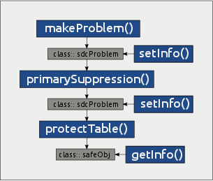

# sdcTable

## **sdcTable** Vignette

### About this vignette

The purpose of the **sdcTable** vignette is to show how to get up and
running with **sdcTable**; for details, including a complete list of
options, consult the help pages or the manual for the following main
functions of the package:

- `makeProblem` using e.g:
  [`help('makeProblem')`](https://sdctools.github.io/sdcTable/reference/makeProblem.md)
  or
  [`?makeProblem`](https://sdctools.github.io/sdcTable/reference/makeProblem.md)
- `primarySuppression` using e.g:
  [`help('primarySuppression')`](https://sdctools.github.io/sdcTable/reference/primarySuppression.md)
  or
  [`?primarySuppression`](https://sdctools.github.io/sdcTable/reference/primarySuppression.md)
- `protectTable` using e.g:
  [`help('protectTable')`](https://sdctools.github.io/sdcTable/reference/protectTable.md)
  or
  [`?protectTable`](https://sdctools.github.io/sdcTable/reference/protectTable.md)
- `setInfo` using e.g:
  [`help('setInfo')`](https://sdctools.github.io/sdcTable/reference/setInfo.md)
  or
  [`?setInfo`](https://sdctools.github.io/sdcTable/reference/setInfo.md)
- `getInfo` using e.g:
  [`help('getInfo')`](https://sdctools.github.io/sdcTable/reference/getInfo.md)
  or
  [`?getInfo`](https://sdctools.github.io/sdcTable/reference/getInfo.md)

### How to protect data - An overview



Figure 1: **sdcTable** - an overview of exported functions

The main functions that are exported to users are shown in [Figure
1](#fig:overview).

Function
[`makeProblem()`](https://sdctools.github.io/sdcTable/reference/makeProblem.md)
is used to create objects of class `sdcProblem`. Instances of class
`sdcProblem` hold the entire information that is required to perform
primary or secondary cell suppression such as assumed to be known upper
and lower cell bounds or upper-, lower- or sliding protection levels
that are required to fulfill when solving the secondary cell suppression
problem. All this information can be modified using function
[`setInfo()`](https://sdctools.github.io/sdcTable/reference/setInfo.md).

[`primarySuppression()`](https://sdctools.github.io/sdcTable/reference/primarySuppression.md)
is applied to objects of class `sdcProblem`. By setting function
parameters users can choose and apply a pre-defined primary suppression
rule. Using
[`setInfo()`](https://sdctools.github.io/sdcTable/reference/setInfo.md),
one can easily implement a custom primary suppression rule, too.

Function
[`protectTable()`](https://sdctools.github.io/sdcTable/reference/protectTable.md)
is used to protect primary sensitive table cells in objects of class
`sdcProblem`. A successful run of function
[`protectTable()`](https://sdctools.github.io/sdcTable/reference/protectTable.md)
results in an object of class `safeObj`. Using
[`getInfo()`](https://sdctools.github.io/sdcTable/reference/getInfo.md)
one can extract information from objects of such class, most importantly
of course a data set containing all table cells along with the
suppression pattern.

More detailed information on all the possibilities is available in the
help-files, additional information is given in the corresponding
sections of this vignette that deal with specific functions. The first
step however to get started is to load the package, which can easily be
done as shown below:

``` r

library(sdcTable)
packageVersion("sdcTable")
```

    ## [1] '0.34.0'

## A simple example

We now walk through the steps that are required to protect tabular data
using **sdcTable**. In the first example we are going to protect table
cells given a three-dimensional tabular structure with some sub-totals.

We will start by discussing input data sets in sections [“Starting from
microdata”](#ex1:microDat) and [“Using aggregated data”](#ex1:aggDat).
Then we continue by discussing how to define and describe dimensional
variables in “Defining hierarchies” which is a crucial step in the
entire procedure. Once the hierarchies are defined it is necessary to
create suitable objects as described ([here](#ex1:makeProb)) that can be
used to identify and suppress primary sensitive cells. This is shown in
section [“Identifying sensitive cells”](#ex1:primSupp). Finally we
discuss how to [“protect primary sensitive table
cells”](#ex1:secondSupp).

Throughout it is also shown how to set and extract information from the
objects we are working with using functions
[`getInfo()`](https://sdctools.github.io/sdcTable/reference/getInfo.md)
and
[`setInfo()`](https://sdctools.github.io/sdcTable/reference/setInfo.md).

#### Starting from microdata

In this example we suppose we have collected data from 1000 individuals.
A subset of the available data is shown below:

    ##  V1 V2 V3 numVal2 numVal1
    ##   A  w  d   49.93   71.72
    ##   C  m  f   48.44   55.96
    ##  Ba  m  a   43.20   64.69
    ##  Bc  w  d   31.38   30.72
    ##  Bc  w  a   49.46   54.93
    ##  Ba  m  d   42.02   22.23

We note that the information we have obtained for any individual
corresponds to exactly one row in the input data.frame. That is supposed
to be available in **R**.

The micro data consist of 5 variables. The first 3 variables (`V1`, `V2`
and `V3`) are categorical variables that will later define the table
that needs to be protected. Variables ‘numVal1’ and ‘numVal2’ correspond
to arbitrary variables containing some kind of information measured for
each individual.

To create the tabular structure that is required to protect any table
cells within the table it is of course of interest to have a look at
possible values or characteristics of the categorical variables that
define the table.

- Variable `V1`: this variable has a total of 6 codes without subtotals
  which are listed below:

&nbsp;

    'A', 'Ba', 'Bb', 'Bc', 'C', 'D'

- Variable `V2`: this variable has a total of 2 codes without subtotals
  which are listed below:

&nbsp;

    'm', 'w'

- Variable `V3`: this variable has a total of 6 codes without subtotals
  which are listed below:

&nbsp;

    'a', 'b', 'c', 'd', 'e', 'f'

The step on how to define level-hierarchies that have to include all
possible (sub)totals is explained [below](#ex1:hier).

#### Using aggregated data

Using **sdcTable** it is also possible to start with a *‘complete’*
dataset. This means that the input dataset already contains rows with
all possible level-combinations that can occur. This also includes
combinations with (sub)totals. In this case it is required that the
input data contain a column holding cell counts. Using the example data
already discussed in section [“Starting from microdata”](#ex1:microDat),
the complete dataset could be specified as shown below:

``` r

print(tail(completeData))
```

    ##      V1  V2 V3 Freq  numVal1  numVal2
    ## 163   C Tot  f   24  7523.30  7305.85
    ## 164   D Tot  f   31  7723.40  7698.75
    ## 165 Tot   m  f  107 24033.37 24325.32
    ## 166   B   m  f   55 12797.11 13372.83
    ## 167 Tot   w  f   85 25082.25 25459.33
    ## 168   B   w  f   50 12600.68 12861.13

Even though we only show a small subset of the data it is immediately
clear that in object `completeData` (sub)totals are listed. These
combinations can be calculated from the microdata by summation over
several codes in one or more dimensional variables. As in section
[Starting from microdata](#ex1:microDat) it is of interest which codes
were specified for each dimensional variable. This information is given
below:

- Variable `V1`: this variable has a total of 8 codes including all
  possible subtotals which are listed below:

&nbsp;

    'Tot', 'A', 'B', 'Ba', 'Bb', 'Bc', 'C', 'D'

- Variable `V2`: this variable has a total of 3 codes including all
  possible subtotals which are listed below:

&nbsp;

    'Tot', 'm', 'w'

- Variable `V3`: this variable has a total of 7 codes including all
  possible subtotals which are listed below:

&nbsp;

    'Tot', 'a', 'b', 'c', 'd', 'e', 'f'

We also note that in `completeData` a variable `Freq` is available which
gives information on the corresponding cell counts. This means that for
example a total of 50 individuals contribute to the table cell where
variable `V1` equals B, variable `V2` is w and variable `V3` is equal to
f.

Whether or not one starts to work with micro data or already with a
complete, pre-aggregated dataset the next step is always the definition
of the hierarchies defining the tabular structure.

#### Defining hierarchies

We could see [here](#ex1:microDat) (for micro data) and
[here](#ex1:aggDat) (for pre-aggregated data) that the set of codes
available in the input data for variables `V1`, `V2` and `V3` differ
since in the case where micro data are used as input data, no codes for
subtotals are included in the micro data while in the case where
pre-aggregated data are used those subtotals must already be included in
the input data set.

When defining the complete hierarchies, no (sub)-totals must be excluded
from the description. This means that for each variable defining one
dimension of the table the complete structure must of course includes
all (sub)totals.

In this example the hierarchies we want to define are quite basic. We
start by showing the level-codes for each variable `V1`, `V2` and `V3`
that are included in `completeData` but not in `microData`.

- (sub)totals of variable `V1`:

&nbsp;

    'Tot', 'B'

- (sub)totals of variable `V2`:

&nbsp;

    'Tot'

- (sub)totals of variable `V3`:

&nbsp;

    'Tot'

We observe that variable `V1` has two codes (Tot and B) that can be
calculated from the codes of `V1` available in the micro data set
`microData`. For variables `V2` and `V3` only one total value (Tot)
exists which means the summation over all characteristics of variables
`V2` and `V3` is the (only) total value. To specify the complete
structure of a dimensional variable one needs to create a data frame or
a matrix for each of those variables. The structure of any object
describing a dimensional variable be created as follows:

- the object must consist of exactly 2 columns, both being character
  vectors
- the first column specifies levels
- the second column specifies level-codes
- the only allowed character in the first column is `@`
- the length of the strings of the first column defines the (numeric)
  level of the corresponding code
- a top-down approach has to be taken
- the object must contain a row for each possible level-code

While this may sound difficult, it is in fact quite easy to create such
objects within **R**. We will now explain how to create the required
objects for the dimensional variables `V1`, `V2` and `V3` used in the
example.

##### defining level-structure for variable `V1`

The hierarchy we want to describe is as follows. The overall code Tot is
calculated from the codes (`A`, `B`, `C` and `D`). Additionally, code
`B` (which is the second (sub)total-code for variable `V1` as described
[here](#ex1:aggDat)) can be calculated from the level-codes `Ba`, `Bb`
and `Bc`.

Following rule 1, we have to create a data frame or matrix consisting of
two columns, the first specifying levels, the second column the
corresponding level codes. Since we have to follow a top-down approach,
the first level code must always correspond to the grand total which is
always considered as the code with a level equaling 1. Thus, we create
the matrix with a single row defining the overall total as follows:

``` r

dimV1 <- matrix(nrow = 0, ncol = 2)
dimV1 <- rbind(dimV1, c("@", "Tot"))
print(dimV1)
```

    ##      [,1] [,2] 
    ## [1,] "@"  "Tot"

The level code for the overall total is `@` because according to rule 4
it is the only allowed character in the first column and it consists of
exactly 1 character. Also, since the overall total is defined as level
1, the number of characters of the string `@` and the level of the
overall total code `Tot` matches.

The next step is to add additional codes. As mentioned before, codes
`A`, `B`, `C` and `D` contribute the the overall total. Therefore we
know that these codes are considered as level 2 codes and must be
(according to the top-down approach) listed below the overall total
code. Adding these codes to object `dimV1` is shown below:

``` r

mat <- matrix(nrow = 4, ncol = 2)
mat[, 1] <- rep("@@", 4)
mat[, 2] <- LETTERS[1:4]
dimV1 <- rbind(dimV1, mat)
print(dimV1)
```

    ##      [,1] [,2] 
    ## [1,] "@"  "Tot"
    ## [2,] "@@" "A"  
    ## [3,] "@@" "B"  
    ## [4,] "@@" "C"  
    ## [5,] "@@" "D"

We know that code `B` is a subtotal that can be calculated from codes
`Ba`, `Bb` and `Bc`. Since `B` is a code of level 2, the codes
contributing to it must be of a lower level, in this case of level 3. We
show below how to add the codes to object `dimV1`:

``` r

mat <- matrix(nrow = 3, ncol = 2)
mat[, 1] <- rep("@@@", 3)
mat[, 2] <- c("Ba", "Bb", "Bc")

dimV1 <- rbind(dimV1, mat)
print(dimV1)
```

    ##      [,1]  [,2] 
    ## [1,] "@"   "Tot"
    ## [2,] "@@"  "A"  
    ## [3,] "@@"  "B"  
    ## [4,] "@@"  "C"  
    ## [5,] "@@"  "D"  
    ## [6,] "@@@" "Ba" 
    ## [7,] "@@@" "Bb" 
    ## [8,] "@@@" "Bc"

Now object `dimV1` contains all possible codes along with their levels.
However, it not valid because the top-down approach is violated. This
means that codes that contribute to a (sub)total must be listed directly
below it. If we would not change the order of object `dimV1`,
**sdcTable** would assume that code `D` can be calculated by summation
over codes `Ba`, `Bb` and `Bc`. For this reason it is necessary to move
this *“block”* up so that it is directly below code `B`. The required
code and the resulting correct object describing the structure of
variable `V1` is printed below:

``` r

dimV1 <- dimV1[c(1:3,6:8, 4:5),]
print(dimV1, row.names = FALSE)
```

    ##      [,1]  [,2] 
    ## [1,] "@"   "Tot"
    ## [2,] "@@"  "A"  
    ## [3,] "@@"  "B"  
    ## [4,] "@@@" "Ba" 
    ## [5,] "@@@" "Bb" 
    ## [6,] "@@@" "Bc" 
    ## [7,] "@@"  "C"  
    ## [8,] "@@"  "D"

Using this information, **sdcTable** internally calculates all kinds of
information on dimensional variables. So for example it is able to deal
with codes that can be (temporarily) removed from the structure because
it can be considered as a *“duplicate”*. This is however not the case
for this basic dimensional variable that has a total of 8 codes of which
6 are required to calculate information for the 2 (sub)totals.

Since versions `>= 0.27`, **sdcTable** allows to use inputs created from
package
[**sdcHierarchies**](https://CRAN.R-project.org/package=sdcHierarchies)
as input. This package allows for a very simple way to create, compute
and modify hierarchies. For a complete introduction, the package
vignette can be viewed with
[`hier_vignette()`](https://bernhard-da.github.io/sdcHierarchies/reference/hier_vignette.html).
The main functions are
[`hier_create()`](https://bernhard-da.github.io/sdcHierarchies/reference/hier_create.html),
[`hier_add()`](https://bernhard-da.github.io/sdcHierarchies/reference/hier_add.html),
[`hier_rename()`](https://bernhard-da.github.io/sdcHierarchies/reference/hier_rename.html)
and
[`hier_delete()`](https://bernhard-da.github.io/sdcHierarchies/reference/hier_delete.html).
We now show an alternative way to generate the hierarchy for variable
`V1`.

``` r

dimV1 <- sdcHierarchies::hier_create(root = "Tot", nodes = LETTERS[1:4])
dimV1 <- sdcHierarchies::hier_add(dimV1, root = "B", nodes = c("Ba","Bb","Bc"))
sdcHierarchies::hier_display(dimV1)
```

    ## Tot
    ## ├─A
    ## ├─B
    ## │ ├─Ba
    ## │ ├─Bb
    ## │ └─Bc
    ## ├─C
    ## └─D

**sdcTable** will internally convert the tree-based structure generated
using functionality from the
[**sdcHierarchies**](https://CRAN.R-project.org/package=sdcHierarchies)
package automatically into the `data.frame` based structure discussed at
the begin of this section.

##### defining level-structure for variable `V2`

The creation of a suitable object that describes the hierarchical
structure of variable `V2` is easy. We are only dealing with one overall
Total (`Tot`) that is the sum of all codes listed [here](#ex1:microDat)
for this variable.

The code how to specify an object that describes the structure of
dimensional variable `V2` is given below:

``` r

dimV2 <- sdcHierarchies::hier_create(root = "Tot", nodes = c("m", "w"))
sdcHierarchies::hier_display(dimV2)
```

    ## Tot
    ## ├─m
    ## └─w

We see that the overall total (`Tot`) is again listed in the first row
with the two other contributing codes (`m` and `w`) being below in the
same hierarchy level.

##### defining level-structure for variable `V3`

The creation of a suitable object that describes the hierarchical
structure of variable `V3` is easy. We are only dealing with one overall
Total (`Tot`) that is the sum of all codes listed [here](#ex1:microDat)
for variable `V3`.

The required code to generate an object specifying the hierarchical
structure of variable `V3` is given below:

``` r

dimV3 <- sdcHierarchies::hier_create(root = "Tot", nodes = letters[1:6])
sdcHierarchies::hier_display(dimV3)
```

    ## Tot
    ## ├─a
    ## ├─b
    ## ├─c
    ## ├─d
    ## ├─e
    ## └─f

It is required to create an object defining the complete structure and
hierarchies for each dimensional variable. Once this step has been done,
the multidimensional tabular structure that is required to apply any
statistical disclosure methods can be created using **makeProblem()**.

#### Creating objects of class `sdcProblem` for further processing

We now show how to create objects of class `sdcProblem` which can
further be used to identify, suppress and protect sensitive table cells.

It was discussed [here](#ex1:microDat) and [here](#ex1:aggDat) how micro
data and pre-aggregated data can be used as data-input objects. We will
now explain how to create instances of class `sdcProblem` from both
`microData` and `completeData` and describe the required and optional
parameters of function
[`makeProblem()`](https://sdctools.github.io/sdcTable/reference/makeProblem.md).

We start building a suitable object of class `sdcProblem` starting with
the data on individual level available from object `microData`.

``` r

dimList <- list(V1 = dimV1, V2 = dimV2, V3 = dimV3)
prob.microDat <- makeProblem(
    data = microData,
    dimList = dimList,
    dimVarInd = 1:3,
    freqVarInd = NULL,
    numVarInd = 4:5,
    weightInd = NULL,
    sampWeightInd = NULL)
```

First we have to combine the objects describing the hierarchical
variables `V1`, `V2` and `V3` into a list-object named `dimList`. Each
list element is one of the objects created in section [“Defining
hierarchies”](#ex1:hier). The names of the list-elements must correspond
to the variable name that the corresponding list-element refers to. In
this case, the first list-element - `dimV1` - should describe variable
`V1` in the input data set `microData` when calling
[`makeProblem()`](https://sdctools.github.io/sdcTable/reference/makeProblem.md)
while the second list element - `dimV2` - defines the hierarchy of
variable `V2` and `dimV3` - the third list element - describes the
structure of variable `V3`.

The remaining parameters are quite self-explanatory and shorty described
below:

- `data`: the data set that should be used, in this case `microData`
- `dimList`: a named list containing information on the structure of
  dimensional variables as described just above
- `dimVarInd`: the column indices of dimensional described in `dimList`.
- `freqVarInd`: if not `NULL`, an index specifying the column that
  contains information on cell counts
- `numVarInd`: if not `NULL`, an index specifying the columns holding
  other numerical variables
- `weightInd`: if not `NULL`, an index specifying the column that
  contains info on weights that should be used in the secondary cell
  suppression problem instead of cell counts
- `sampWeightInd`: if not `NULL`, an index specifying the column holding
  sampling weights for each person/group

Building an object of class `sdcProblem` using the complete,
pre-aggregated data `completeData` as discussed [above](#ex1:aggDat) is
very similar as it is shown below:

``` r

### problem from complete data ###
dimList <- list(V1 = dimV1, V2 = dimV2, V3 = dimV3)
prob.completeDat <- makeProblem(
    data = completeData,
    dimList = dimList,
    dimVarInd = 1:3,
    freqVarInd = 4,
    numVarInd = 5:6,
    weightInd = NULL,
    sampWeightInd = NULL)
```

The only difference is that in this case we define parameter
‘freqVarInd’ that specifies a column within the input data set {}
containing information on cell counts. Also the indices of argument
`numVarInd` are different to the first example.

In any case, both procedures return an object of class `sdcProblem` as
it can easily be checked:

``` r

all(c(class(prob.microDat), class(prob.completeDat)) == "sdcProblem")
```

    ## [1] TRUE

We now can check if the cell counts of both objects are equal. Function
[`getInfo()`](https://sdctools.github.io/sdcTable/reference/getInfo.md)
can be used to extract information from objects of class `sdcProblem`.
Specifying argument `type` as `freq`,
[`getInfo()`](https://sdctools.github.io/sdcTable/reference/getInfo.md)
returns cell counts which are indeed equal independently if micro-data
or pre-aggregated data have been used as input to create the complete
tabular structure.

``` r

counts1 <- getInfo(prob.completeDat, type = "freq")
counts2 <- getInfo(prob.microDat, type = "freq")
all(counts1 == counts2)
```

    ## [1] TRUE

Once the problem has been set up and an instance of class {} is
available, it is possible to identify and suppress sensitive table cells
as we demonstrate in the next section using object `prob.completeDat`.

#### Identifying sensitive cells

Identifying and suppressing primary sensitive cells is usually done by
applying function
[`primarySuppression()`](https://sdctools.github.io/sdcTable/reference/primarySuppression.md).

Having a look at the cell counts in table `prob.completeDat` shows that
a total of 15 cells have less than 10 individuals contributing to it. We
think that these cells should be considered as primary sensitive and we
want to have them protected.

When creating an object of class `sdcProblem`, all cells are assigned an
anonymization state. The possible codes are listed below:

- `"u"`: cell is primary suppressed and needs to be protected
- `"x"`: cell has been secondary suppressed
- `"s"`: cell can be published
- `"z"`: cell must not be suppressed

The goal is now to change the anonymization status of all cells having
less than 10 individuals contributing to it from the default value of
`s` to `u`. The easiest way is to use function
[`primarySuppression()`](https://sdctools.github.io/sdcTable/reference/primarySuppression.md)
directly:

``` r

prob.completeDat <- primarySuppression(prob.completeDat, type = "freq", maxN = 10)
```

Argument `type` specifies the primary suppression rule we want to apply.
In this case we want to use the frequency threshold rule that allows to
suppress all table cells having cell counts less or equal than the
threshold specified using argument `maxN`.
[`primarySuppression()`](https://sdctools.github.io/sdcTable/reference/primarySuppression.md)
also allows to apply the nk-dominance rule or the p-percent rule
directly, in case micro data have been used as input data. For all
possible parameters and their explanation the interested reader may
consult the manual or the help-page of
[`primarySuppression()`](https://sdctools.github.io/sdcTable/reference/primarySuppression.md).

After performing the suppression, we can have a look at the distribution
of the anonymization states:

``` r

print(table(getInfo(prob.completeDat, type = "sdcStatus")))
```

    ## 
    ##   s   u 
    ## 153  15

``` r

summary(prob.completeDat)
```

    ## The raw data contain pre-aggregated (tabular) data!
    ## 
    ## The complete table to protect consists of 168 cells and has 3 spanning variables.
    ## The distribution of
    ## - primary unsafe (u)
    ## - secondary suppressed (x)
    ## - forced to publish (z) and
    ## - selectable for secondary suppression (s) cells is shown below:
    ## 
    ##   s   u 
    ## 153  15 
    ## 
    ## If this table is protected with heuristic methods, a total of 12 has (sub)tables must be considered!

One can see that the 15 cells having counts less or equal than 10 have
been identified and marked as primary suppressed. However, we should
note that it is very easy to implement custom suppression rules by
manually changing the anonymization state of cells using functions
[`setInfo()`](https://sdctools.github.io/sdcTable/reference/setInfo.md)
or
[`change_cellstatus()`](https://sdctools.github.io/sdcTable/reference/change_cellstatus.md).
Information on how to use these functions is of course provided in the
manual and the corresponding help-pages.

To protect these cells by solving the secondary cell suppression problem
one can go on to use function
[`protectTable()`](https://sdctools.github.io/sdcTable/reference/protectTable.md)
as explained in the next section.

#### Secondary cell suppression using **sdcTable**

**sdcTable** provides algorithms to protect primary sensitive table
cells defined in objects of class `sdcProblem`. The algorithms that may
be selected are shown below:

- **“GAUSS”**: secondary suppression algorithm based on Gaussian
  elimination implemented in
  [`SSBtools::GaussSuppression()`](https://statisticsnorway.github.io/ssb-ssbtools/reference/GaussSuppression.html).

- **“OPT”**: protect the complete hierarchical, multidimensional table
  at once. This algorithm is however only suitable for small problem
  instances.

- **“HITAS”**: solving the secondary cell suppression problem by
  applying a cut and branch algorithm to sub-tables that are protected
  in specific order

- **“HYPERCUBE”**: solving the problem using a heuristic that is based
  on finding geometric hyper-cubes that are required to protect primary
  sensitive table cells. This algorithm is not extensively tested. It is
  a better idea to create a batch-file usable for
  [tau-argus](https://github.com/sdcTools/tauargus) using
  [`createArgusInput()`](https://sdctools.github.io/sdcTable/reference/createArgusInput.md)
  ([`?createArgusInput`](https://sdctools.github.io/sdcTable/reference/createArgusInput.md))
  and solve the problem using Argus.

- **“SIMPLEHEURISTIC”**: solving the problem using a heuristic approach
  that aims to only protect against exact recalculation of values.
  Internally, attacker-problems are iteratively solved until all primary
  sensitive cells are protected.

  > **Note on Performance:** Starting from version `> 0.33`, both
  > [`attack()`](https://sdctools.github.io/sdcTable/reference/attack.md)
  > and `protectTable(..., method = "SIMPLEHEURISTIC")` support an
  > optional `n_workers` parameter. When `n_workers > 1`, the underlying
  > attacker-problems are solved in parallel using the `future.apply`
  > framework, significantly reducing computation time for large tables.
  > This parameter is passed through from
  > [`protectTable()`](https://sdctools.github.io/sdcTable/reference/protectTable.md)
  > directly to the underlying
  > [`attack()`](https://sdctools.github.io/sdcTable/reference/attack.md)
  > calls; otherwise, processing is performed sequentially.
  >
  > **Warning:** Parallel processing spawns multiple independent `R`
  > sessions, each requiring its own memory allocation. Depending on the
  > size of your constraint matrix and the complexity of the
  > optimization, this can lead to a significant increase in RAM usage.
  > Ensure your system has sufficient memory available before scaling up
  > `n_workers` for large table structures.

- **“SIMPLEHEURISTIC_OLD”**: the heuristic procedure implemented in
  `sdcTable` versions `< 0.32`.

We show how to protect the data using the available algorithms. For an
extensive discussion on the possible parameters have a look at the
manual or help page for function
[`protectTable()`](https://sdctools.github.io/sdcTable/reference/protectTable.md).

``` r

resGAUSS <- protectTable(prob.completeDat, method = "GAUSS")
resHITAS <- protectTable(prob.completeDat, method = "HITAS")
resOPT <- protectTable(prob.completeDat, method = "OPT")
resHYPER <- protectTable(prob.completeDat, method = "HYPERCUBE")
resSIMPLE <- protectTable(prob.completeDat, method = "SIMPLEHEURISTIC")
```

Having a look at the resulting objects we can observe that the number of
secondary suppressions required to protect the 15 primary sensitive
cells (by default against exact re-calculation given sliding protection
levels of 1 for each primary sensitive cell) differs.

Using the *“OPT”*-algorithm, a total of 22 cells have been marked as
secondary suppressions. When using *“HITAS”*-algorithm, it was required
to additionally suppress 13 cells. A total of 27 cells was selected and
marked as secondary suppressions when the *“HYPERCUBE”* algorithm was
used while 27 additional suppressions were required for the fast
heuristic simple procedure *“SIMPLEHEURISTIC”* and 23 supps for the
Gaussian elimination method.

One now easily get information from the resulting output objects that
are instances of class `safeObj` by using function
[`getInfo()`](https://sdctools.github.io/sdcTable/reference/getInfo.md)
or applying the `summary`-method. For the former we show how to extract
the final data set which can be achieved as follows:

``` r

finalData <- getInfo(resOPT, type = "finalData")
print(head(finalData))
```

    ##        V1     V2     V3  Freq   numVal1   numVal2 sdcStatus
    ##    <char> <char> <char> <num>     <num>     <num>    <char>
    ## 1:    Tot    Tot    Tot  1000 294693.72 298707.90         s
    ## 2:    Tot    Tot      a   178  49115.62  49784.65         s
    ## 3:    Tot    Tot      b   159  49115.62  49784.65         s
    ## 4:    Tot    Tot      c   177  49115.62  49784.65         s
    ## 5:    Tot    Tot      d   144  49115.62  49784.65         s
    ## 6:    Tot    Tot      e   150  49115.62  49784.65         s

As we can see above the final result data set contains all columns
specified in the input data set along with another column `sdcStatus`
that specifies the anonymization state for each table cell.

For the latter we show how to apply the summary method. This can be done
by applying the following code:

``` r

summary(resOPT)
```

    ## 
    ## #####################################

    ## ### Summary of the protected data ###

    ## #####################################

    ## --> The input data have been protected using algorithm 'OPT'

    ## --> To protect 15 primary sensitive cells, 22 cells were additionally suppressed

    ## --> A total of 131 cells may be published

    ## 
    ## ###################################

    ## ### Structure of protected data ###

    ## ###################################

    ## Classes 'safeObj', 'data.table' and 'data.frame':    168 obs. of  7 variables:
    ##  $ V1       : chr  "Tot" "Tot" "Tot" "Tot" ...
    ##  $ V2       : chr  "Tot" "Tot" "Tot" "Tot" ...
    ##  $ V3       : chr  "Tot" "a" "b" "c" ...
    ##  $ Freq     : num  1000 178 159 177 144 150 192 487 82 80 ...
    ##  $ numVal1  : num  294694 49116 49116 49116 49116 ...
    ##  $ numVal2  : num  298708 49785 49785 49785 49785 ...
    ##  $ sdcStatus: chr  "s" "s" "s" "s" ...
    ##  - attr(*, ".internal.selfref")=<pointer: 0x561ce42c7ef0> 
    ## NULL

We see that the summary provides all kind of useful information such as
the algorithm that has been used to protect primary sensitive cells, the
time it has been taken to solve the problem, the number of primary
sensitive and secondary suppressed cells as well as the number of cells
that may be published. Also, a excerpt of the final data set is shown.

I would also like to mention that an iterative algorithm is available in
function
[`protectLinkedTables()`](https://sdctools.github.io/sdcTable/reference/protect_linked_tables.md)
that allows to protect two tables that have common table cells. The
function takes two objects of class `sdcProblem` as input and a list
defining the common cells in both tables. Details on how to construct
this a list-element are given in the manual and help-page of
[`protectLinkedTables()`](https://sdctools.github.io/sdcTable/reference/protect_linked_tables.md).

## Remarks

A lot of work has gone into the rewrite of **sdcTable** using S4-classes
and methods in order to robustify the code and in order to make it
easier in future to add new algorithms such as rounding- or
cell-perturbation methods and features.

I would really like to hear any kind of feedback and will be more than
happy to work in patches you submit or ideas any one might have which
would make it easier to work **sdcTable**. Also, the next step in the
evolution of the package will be performance optimization, evaluation
for possibilities of parallel computing and so on. I would really like
to hear any kind of feedback on package users on these kind of things.
Thus, for any remarks, please do not hesitate to contact me using my
e-mail adress `bernhard.meindl@statistik.gv.at`.
